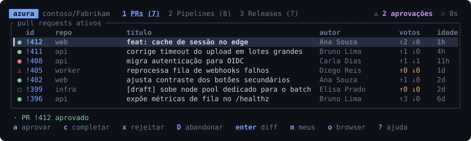
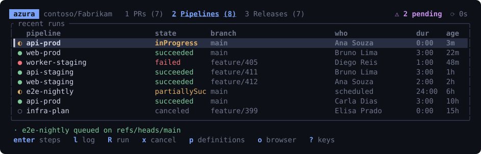
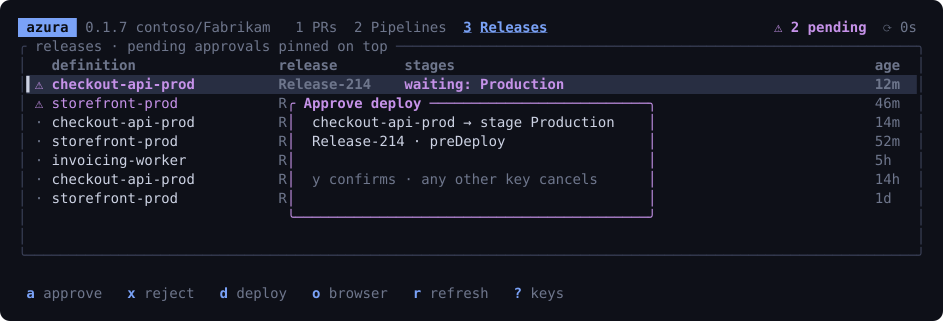
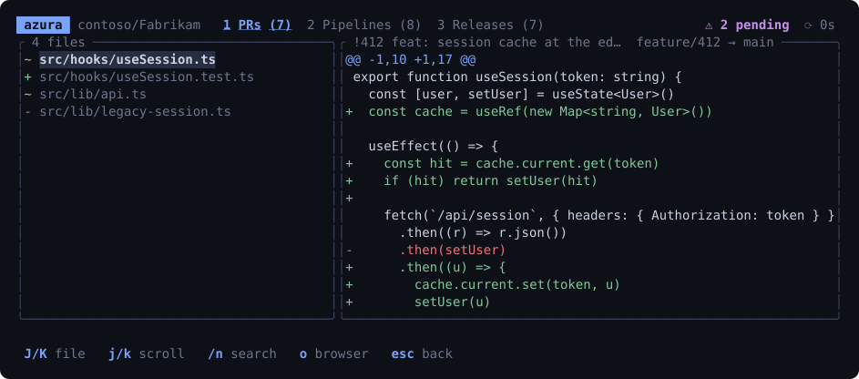

# azura

TUI para gerenciar **pull requests, pipelines e releases do Azure DevOps** sem sair do terminal.
Aprovar um deploy de produção vira uma tecla e uma confirmação, em vez de cinco cliques no portal.

[](https://github.com/edivanteixeira/azura/actions/workflows/ci.yml)
[](LICENSE)



## Instalação

```sh
curl -fsSL https://raw.githubusercontent.com/edivanteixeira/azura/main/install.sh | sh
```

Ou baixe o binário da sua plataforma em [Releases](https://github.com/edivanteixeira/azura/releases)
— macOS (Intel e Apple Silicon), Linux (x86_64 e arm64) e Windows. Nada de runtime: é um binário só.

```sh
# instalar em outro diretório, sem sudo
AZURA_INSTALL_DIR=$HOME/.local/bin curl -fsSL https://raw.githubusercontent.com/edivanteixeira/azura/main/install.sh | sh

# ou pela fonte
cargo install --git https://github.com/edivanteixeira/azura
```

## Primeiro uso

Rode `azura`. Na primeira vez ele pede organização, projeto e um Personal Access Token,
valida contra a API e salva em `~/.config/azura/config.toml` com permissão `600`.
Se você já usa `az devops configure`, a organização e o projeto vêm preenchidos.

O PAT sai de **Azure DevOps → User settings → Personal access tokens**, com os escopos:

| escopo | por quê |
|---|---|
| Code (read & write) | ler PRs e diffs, votar, completar, abandonar |
| Build (read & execute) | listar execuções e logs, disparar, cancelar |
| Release (read, write, execute & manage) | aprovar, rejeitar e promover stages |

Para trocar de projeto ou de token depois: `azura setup`.

## O que dá para fazer

### Pipelines

`enter` abre os passos da execução, `l` pula direto para o log do passo que falhou —
o motivo de 90% das idas ao browser.



### Releases

Aprovações pendentes ficam fixadas no topo. Toda ação que sai da sua máquina passa por
uma confirmação que diz exatamente o que vai acontecer.



### Diff de PR, dentro da CLI

Sem clone local: os arquivos alterados e o conteúdo dos dois lados vêm da API.



## Atalhos

`?` abre a lista completa dentro do app.

| | |
|---|---|
| `1` `2` `3` `tab` | PRs · Pipelines · Releases |
| `j/k` `g/G` `ctrl-d/u` | navegar |
| `/` `esc` | filtrar · limpar |
| `r` | atualizar (automático a cada 30s) |
| `o` `enter` | abrir no browser · detalhe |
| **PRs** | `a` aprovar · `w` aguardando autor · `x` rejeitar · `c` completar · `D` abandonar · `m` só os meus · `enter` diff |
| **Pipelines** | `enter` passos · `l` log do que falhou · `R` disparar · `x` cancelar · `p` definições |
| **Releases** | `a` aprovar · `x` rejeitar · `d` deploy de stage |
| **Diff e log** | `J/K` troca de arquivo · `j/k` rola · `/` `n` busca |

O filtro casa com tudo que está na tela — título, repo, autor, branch, estado, stages.
`/failed` mostra só o que quebrou, `/conflicts` só os PRs com conflito, `/production` só a produção.

## Segurança

- **`azura --dry-run`** — nenhuma escrita é enviada; cada ação só descreve o request que faria.
  Boa forma de conhecer o app sem risco.
- Completar, abandonar, disparar, cancelar, aprovar, rejeitar e fazer deploy **sempre** pedem
  confirmação nomeando o alvo. Aprovar um PR (que é reversível) vai direto.
- O token fica em `~/.config/azura/config.toml` com permissão `600` e nunca sai para outro host
  além do `dev.azure.com` / `vsrm.dev.azure.com` da sua organização.

## Configuração

```toml
# ~/.config/azura/config.toml
org     = "contoso"
project = "Fabrikam"
pat     = "..."
```

As variáveis `AZDO_ORG`, `AZDO_PROJECT` e `AZDO_PAT` (ou `AZURE_DEVOPS_EXT_PAT`) sobrescrevem o
arquivo — útil em scripts. No lugar de um PAT também funciona um bearer do `az`:

```sh
export AZDO_PAT=$(az account get-access-token \
  --scope 499b84ac-1321-427f-aa17-267ca6975798/.default --query accessToken -o tsv)
```

## Desenvolvimento

```sh
cargo test                                  # unitários + render de todas as telas
cargo test -- --ignored --nocapture         # smoke test contra a sua org real
cargo test shot -- --ignored                # regera os SVGs do README
```

Os testes de render desenham as 5 telas × 3 abas × 3 modais em 4 tamanhos de terminal,
incluindo 8×3 — é onde as contas de layout estouram.

## Licença

MIT
